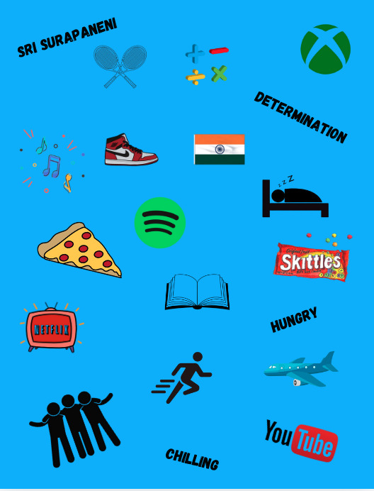

Hi! My name is Sri Surapaneni and Im a junior at Del Norte High School. I wanted to take CSA because I intend on majoring in a STEM field in the future, so I want to strengthen my coding skills incase I want to go into the CS side. Last year, I took CSP and had a lot of fun with group projects. I helped Jonathan Liu and a bunch others build cool projects such as a twitter clone where users can post about their daily live or random images. Outside of school, I run a lot, play tennis, work on robotics with my teams in FRC and FTC, and teach kids basic subjects. In my free time I like to play video games, read, watch netflix, sleep, and spend time with my family. I have a brother that took CSA before (Aditya) and he is majoring in Data Science at UCSD. Below is a collage that represents me.

